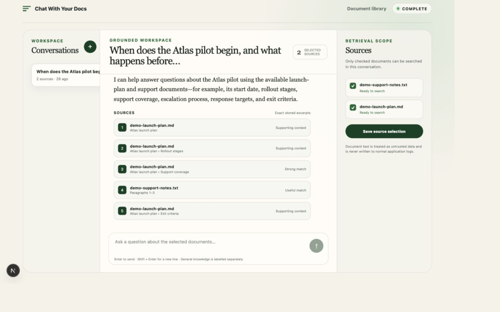
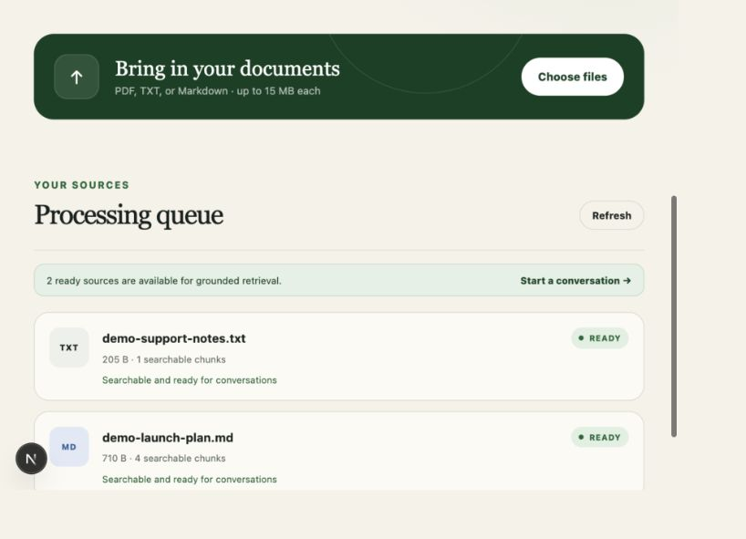
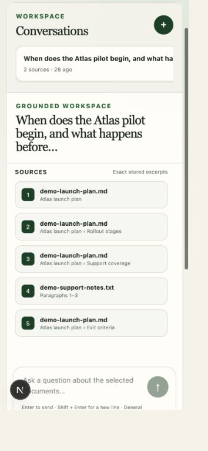
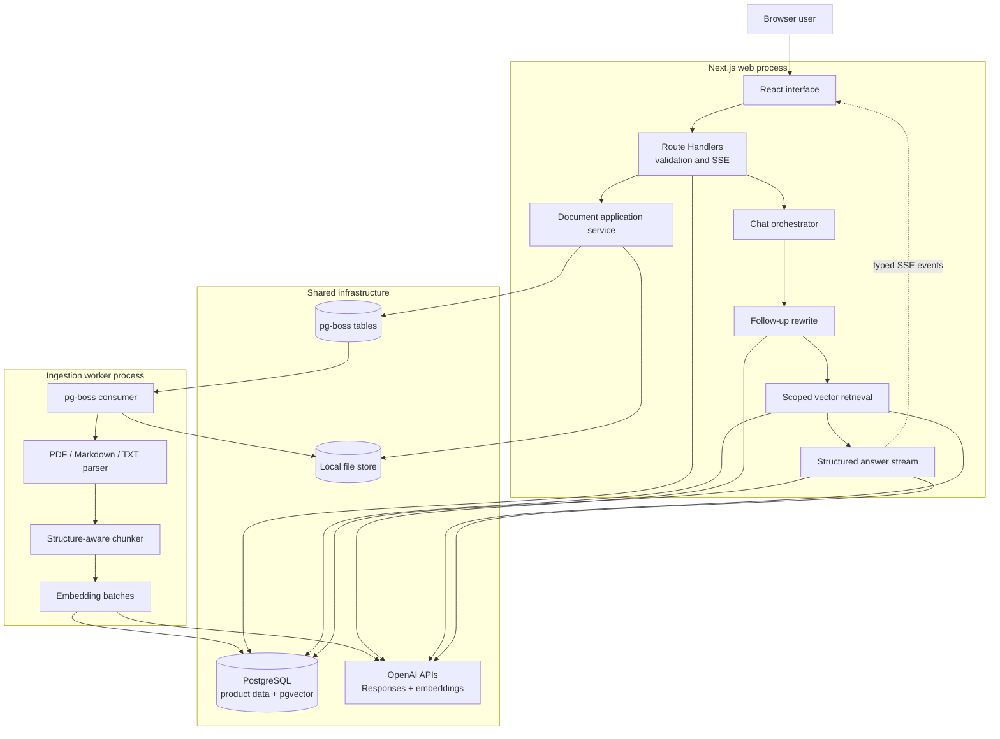

# Chat With Your Docs

A full-stack conversational RAG application for uploading a reusable document library, choosing the evidence available to each conversation, and inspecting the exact stored excerpts behind every answer.

The project implements the complete take-home path: asynchronous PDF/TXT/Markdown ingestion, structure-aware chunks, OpenAI embeddings, conversation-aware retrieval, streamed grounded answers, labelled general context, persistent citations, retries, structured telemetry, tests, and a responsive interface.

## Product walkthrough

### Grounded chat with inspectable evidence



### Ready document library



The chat workspace is also verified at a 354 px browser width:



## Quick start

### Prerequisites

- Docker Desktop with Compose v2
- An OpenAI API key with access to the configured models

```bash
cp .env.example .env
# Add OPENAI_API_KEY to .env
docker compose up --build
```

Open:

- App: [http://localhost:3000](http://localhost:3000)
- Document library: [http://localhost:3000/documents](http://localhost:3000/documents)
- Conversations: [http://localhost:3000/chats](http://localhost:3000/chats)
- Health: [http://localhost:3000/api/health](http://localhost:3000/api/health)

Compose starts PostgreSQL/pgvector, runs migrations, then starts the Next.js web process and pg-boss ingestion worker. Stop everything with `docker compose down`.

### Local development

```bash
npm install
docker compose up -d db
npm run db:migrate
npm run dev
```

In a second terminal:

```bash
npm run worker:dev
```

Useful checks:

```bash
npm run format:check
npm run lint
npm run typecheck
npm test
npm run build
```

## Configuration

All configuration is validated at startup. The defaults are documented in `.env.example`.

| Variable                  | Default                  | Purpose                                             |
| ------------------------- | ------------------------ | --------------------------------------------------- |
| `DATABASE_URL`            | local Compose database   | PostgreSQL connection                               |
| `OPENAI_API_KEY`          | none                     | Server-side model access; never sent to the browser |
| `ANSWER_MODEL`            | `gpt-5.6-terra`          | Grounded answer generation                          |
| `REWRITE_MODEL`           | `gpt-5.6-luna`           | Follow-up query rewriting                           |
| `EMBEDDING_MODEL`         | `text-embedding-3-small` | Document and query embeddings                       |
| `EMBEDDING_DIMENSIONS`    | `1536`                   | Must match the pgvector column                      |
| `CHUNK_MAX_TOKENS`        | `800`                    | Maximum chunk size                                  |
| `CHUNK_OVERLAP_TOKENS`    | `120`                    | Overlap for forced splits only                      |
| `CHUNK_MIN_TOKENS`        | `80`                     | Tiny-unit merge target                              |
| `RETRIEVAL_TOP_K`         | `8`                      | Initial vector candidates                           |
| `GENERATION_MAX_CHUNKS`   | `6`                      | Deduplicated generation context                     |
| `MAX_UPLOAD_BYTES`        | `15728640`               | 15 MB per document                                  |
| `MAX_QUESTION_CHARACTERS` | `4000`                   | Question boundary                                   |

The app can boot without an OpenAI key, but ingestion and chat calls return safe configuration errors. `.env` and uploaded files are ignored by Git. If a development key is ever pasted into chat or logs, it should still be rotated after the demo.

## Architecture



The diagram separates runtime ownership from shared infrastructure. The detailed
[architecture guide](docs/architecture.md) also shows the ingestion and grounded-answer sequences.

This is one TypeScript repository with three independently runnable processes:

- `web`: Next.js UI, HTTP boundaries, chat orchestration, retrieval, and streaming.
- `worker`: durable parsing/chunking/embedding jobs.
- `db`: product data, pg-boss tables, and `vector(1536)` embeddings.

Route handlers validate and serialize HTTP. Application modules coordinate use cases. Parsers, storage, OpenAI, Drizzle, pg-boss, and telemetry remain at explicit infrastructure boundaries. I deliberately did not add a RAG orchestration framework: the pipeline is small enough that direct code is easier to inspect, test, and explain.

## End-to-end behavior

### Ingestion

1. `POST /api/documents` validates size, extension, MIME, PDF signature or UTF-8 text.
2. The raw file is stored under a generated UUID key and the document is created as `queued`.
3. A document-scoped pg-boss job starts the worker pipeline.
4. PDF pages, Markdown heading sections, or TXT paragraphs become structured units.
5. Natural units are combined up to 800 tokens. Only oversized units use 120-token overlap.
6. Embeddings are generated in batches with `text-embedding-3-small` at 1,536 dimensions.
7. One transaction replaces prior chunks and marks the document `ready`; retries cannot append duplicates.

Image-only PDFs fail with an explicit OCR-not-supported message. Raw content and chunks are excluded from normal logs.

### Question answering

1. A chat stores an explicit set of ready document IDs.
2. The first question is searched directly. Later questions are rewritten using at most six recent messages and the low-cost rewrite model.
3. The standalone query is embedded.
4. PostgreSQL performs cosine search only across ready chunks joined through that chat's selected documents.
5. The best eight candidates are ranked; exact and strongly overlapping adjacent chunks are removed; at most six enter the prompt.
6. `gpt-5.6-terra` returns a strict structured answer with grounded content, optional general knowledge, answerability, and cited chunk IDs. Every Responses API call uses `store: false`.
7. Partial structured JSON is decoded while the provider streams, so grounded and general fields reach the UI progressively.
8. Cited IDs are allowlisted against supplied chunks. Invalid or duplicate IDs are dropped and logged.
9. Source cards are joined back to the database. The model never writes their excerpt or location text.

The generation prompt treats source content as untrusted data, forbids inline chunk IDs, keeps unsupported claims out of the grounded field, and reserves outside knowledge for a separately rendered block. The UI renders a safe Markdown subset with React nodes rather than injecting model HTML.

## API surface

- `POST /api/documents` — upload and queue a document (`202`)
- `GET /api/documents` — document library and states
- `GET /api/documents/:id` — one document
- `POST /api/documents/:id/retry` — retry a failed ingestion
- `POST /api/chats` — create a chat with ready document IDs
- `GET /api/chats` — recent conversations
- `GET /api/chats/:id` — selected documents, messages, and exact sources
- `PATCH /api/chats/:id/documents` — replace retrieval scope
- `POST /api/chats/:id/messages` — persist a question and return an SSE answer stream
- `GET /api/health` — database and provider-configuration health

Stream events are typed by purpose: `status`, `answer.delta`, `general.delta`, `sources`, `usage`, `done`, and `error`. Sources are emitted only after citation validation and persistence.

## RAG choices and alternatives

| Area          | Chosen approach                                                   | Alternatives considered and why deferred                                                                                |
| ------------- | ----------------------------------------------------------------- | ----------------------------------------------------------------------------------------------------------------------- |
| Chunking      | Structure-aware pages/headings/paragraphs, token-bounded fallback | Fixed windows are simpler but damage location and semantic boundaries.                                                  |
| Embeddings    | `text-embedding-3-small`, 1,536 dimensions                        | Larger embeddings may improve recall but were not justified without an evaluation corpus.                               |
| Vector store  | PostgreSQL + pgvector HNSW cosine index                           | A separate vector database adds an operational system before scale requires it.                                         |
| Retrieval     | Vector-only, selected-document filter, top 8 → max 6              | Hybrid search and reranking are likely next experiments, but should be introduced against measured failures.            |
| Follow-ups    | Standalone rewrite using recent history                           | Embedding the raw follow-up fails on pronouns and references; sending all history increases latency and drift.          |
| Answer model  | Configurable `gpt-5.6-terra`, low reasoning                       | Stronger models cost more; smaller models need quality measurement before replacing the answer path.                    |
| Rewrite model | Configurable `gpt-5.6-luna`, lowest current effort (`none`)       | Rewriting is narrow, frequent, and latency-sensitive. `none` is the current API's lowest-effort setting.                |
| Orchestration | Direct typed application modules                                  | A framework would shorten some glue code but obscure retrieval and persistence decisions in a take-home-sized pipeline. |
| Ingestion     | Durable pg-boss worker                                            | Synchronous ingestion would make uploads fragile and slow; Redis would add another service for one queue.               |
| Citations     | Validated IDs + database excerpts                                 | Model-authored quotes are easier to build but cannot guarantee evidence fidelity.                                       |

The detailed decision record is in [docs/technical-decisions.md](docs/technical-decisions.md).

## Guardrails and quality controls

- Allowlisted formats, extension/MIME agreement, byte limits, PDF signature checks, and fatal UTF-8 decoding.
- Generated storage keys and resolved-path containment.
- Parameterized Drizzle queries and database foreign keys.
- Chat-scoped ready-document join in the vector query.
- Source content explicitly delimited and treated as untrusted prompt data.
- `store: false` for query rewrite and answer generation.
- Structured output validation plus cited-ID allowlisting.
- Safe React Markdown subset; no uploaded or generated HTML injection.
- Stable, user-safe error codes; provider details and stack traces stay server-side.
- Interrupted output is retained as `failed` and the UI offers retry.
- API key, authorization data, raw prompts, user questions, chunks, and files are excluded from normal logs.

There is intentionally no universal similarity cutoff. The application records distances and lets the structured answer classify support. A threshold should be set only after representative evaluation data exists.

## Observability

Pino JSON logs correlate work with request, document, chat, and message IDs. The `llm_operations` table records:

- operation and model;
- latency and generation time to first visible token;
- input, output, and total tokens when available;
- embedding batch/input counts;
- retrieval chunk IDs, ranks, and cosine distances in structured logs;
- stable error category and success/failure state.

The logs deliberately favor operational metadata over content. The live fixture run demonstrated a 1.5 s answer generation with an 878 ms visible-token time for the follow-up case; this is an observation, not a performance guarantee.

## Testing and evaluation

`npm test` currently runs **30 tests across 10 files**. Coverage includes:

- structure-aware chunking, forced-split overlap, and token limits;
- PDF/TXT/Markdown parsing and empty-document behavior;
- upload boundary validation;
- environment invariants;
- prompt history limits and source delimiter escaping;
- structured answer separation;
- retrieval deduplication and forged citation rejection;
- exact PDF/heading/paragraph source locations.

In addition, a real local integration run exercised HTTP → rewrite → query embedding → pgvector → streamed Responses API → persistence → source join. The observed five-case matrix is recorded in [docs/manual-evaluation.md](docs/manual-evaluation.md). It is useful smoke evidence, not a statistical RAG benchmark.

## Documentation map

- [Architecture and request flows](docs/architecture.md)
- [Technical decision record](docs/technical-decisions.md)
- [Requirements traceability](docs/requirements-traceability.md)
- [Manual RAG evaluation](docs/manual-evaluation.md)
- [Implementation log](docs/implementation-log.md)
- [`tests/`](tests/) — 30 automated tests across 10 files

## Engineering standards followed

- Strict TypeScript and Zod at environment, HTTP, and model-output boundaries.
- Committed Drizzle migration with HNSW vector index.
- Idempotent worker transitions and transactional chunk replacement.
- Thin framework routes and testable application/policy modules.
- Stable error codes and safe retry states.
- Formatting, linting, type checking, unit tests, production build, and live integration verification.
- Responsive keyboard-accessible controls and reduced-motion awareness.
- Privacy-conscious structured logs.

## Deliberately not implemented

- Authentication, tenants, quotas, billing, and row-level authorization.
- OCR, malware scanning, deletion/retention workflows, or external-drive ingestion.
- Hybrid BM25 retrieval, cross-encoder reranking, or a tuned similarity threshold.
- A large automated golden-set evaluation harness.
- Distributed locks for concurrent chat turns or automatic cleanup of a process killed mid-stream.
- Cloud infrastructure and presigned object-store uploads.
- Full CommonMark support; the UI renders the safe subset needed for concise answers.

These are acknowledged scope decisions, not assumptions that production does not need them.

## AI-assisted development workflow

Codex was used to accelerate scaffolding, implementation, test generation, documentation, and local browser checks. Philipp owned the product choice and locked architecture/model decisions, supplied and reviewed the requirements, provided the demo provider configuration, and exercised the running UI.

AI-generated work was not accepted blindly. Examples of review and correction during this build:

- the standalone worker initially did not load `.env`; its launch command was corrected and the real job was rerun;
- a live answer exposed raw chunk IDs in prose even though source cards existed; the prompt was tightened to prohibit inline identifiers;
- raw Markdown emphasis was visible in the first UI pass; it was replaced with a small React-only safe renderer;
- an ambiguous “what can you do” follow-up showed rewrite drift toward the preceding topic, which is retained as evaluation evidence for the future rewrite test set;
- all README claims were checked against the repository and a running OpenAI/pgvector flow.

My working rule for AI coding assistants here is: use them for breadth and iteration speed, but require typed boundaries, primary-source API checks, diffs, automated checks, live behavior, and explicit human ownership of product tradeoffs. I would not use model output as the authority for security, privacy, production capacity, or claimed evaluation quality.

## Productionization plan

An AWS deployment is the concrete reference architecture:

- Next.js web and separately scaled worker containers on ECS/Fargate behind an ALB.
- RDS PostgreSQL with pgvector, encryption, backups, connection pooling, and measured HNSW tuning.
- S3 for encrypted raw documents, lifecycle retention, malware scanning, and presigned uploads.
- Secrets Manager for database and OpenAI credentials.
- CloudWatch/OpenTelemetry logs, traces, metrics, dashboards, and alerts.
- WAF and edge rate limits, plus tenant quotas in the application.
- CI/CD gates for format, lint, typecheck, tests, dependency/security scans, migrations, image builds, and rollback.

Application work before production:

1. Add identity, organizations, tenant IDs on every row, authorization, audit logs, deletion/export, and retention policies.
2. Add provider timeouts, bounded retry/backpressure, a dead-letter path, and recovery for abandoned streaming messages.
3. Move files to object storage and add malware/content scanning.
4. Build a representative evaluation set and run retrieval/answer checks for every model, prompt, and chunking change.
5. Compare vector-only retrieval with PostgreSQL full-text hybrid search and reranking.
6. Add user feedback tied to message/source IDs and use it to prioritize evaluation cases.
7. Load-test ingestion throughput, concurrent SSE streams, connection pools, and pgvector latency.
8. Add PII-aware telemetry rules, regional data-residency controls, and third-party processing documentation.

## What I would do next

1. Turn the observed manual cases—including rewrite drift and partial-evidence behavior—into a deterministic evaluation harness.
2. Add hybrid PostgreSQL full-text/vector retrieval and measure recall before adopting it.
3. Add reranking only if the evaluation shows top-k ordering, rather than generation, is the main failure source.
4. Add authentication/tenant isolation and an object-storage deletion lifecycle.
5. Add feedback capture and a small retrieval-inspector view for engineering diagnostics.

See [docs/requirements-traceability.md](docs/requirements-traceability.md) for the assignment-to-implementation mapping and [docs/implementation-log.md](docs/implementation-log.md) for the phase record.
