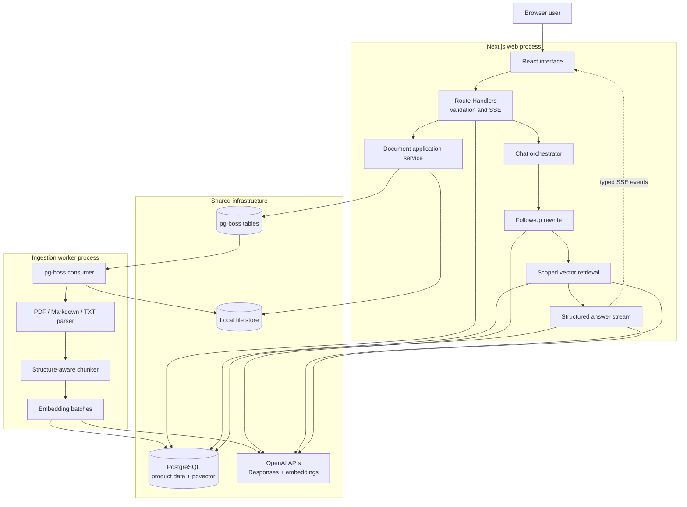
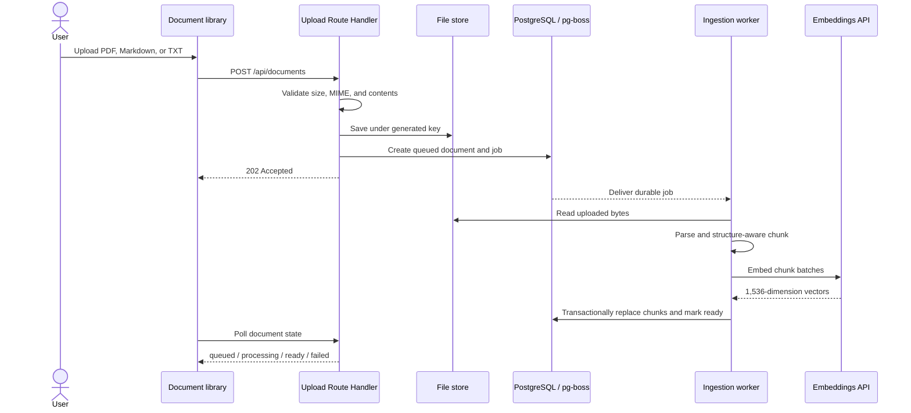
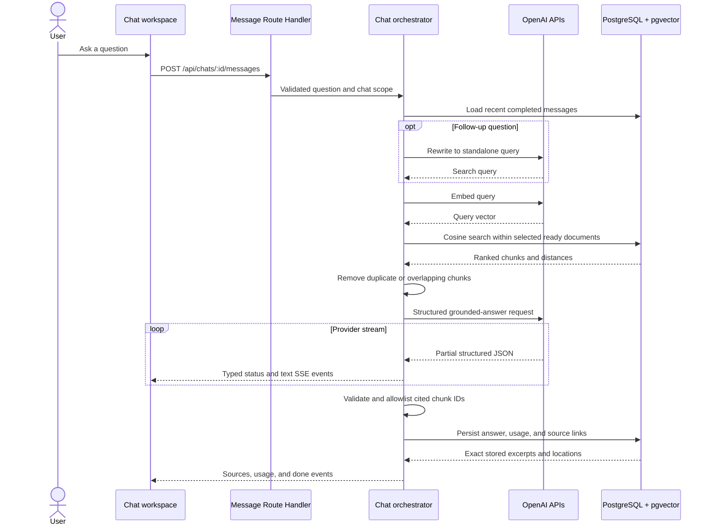

# Architecture

The application is a modular TypeScript system with three separately runnable processes: the Next.js web application, the ingestion worker, and PostgreSQL. PostgreSQL also provides pgvector search and the durable pg-boss queue, which keeps the local stack small without merging runtime responsibilities.

## Component view

## Document-ingestion sequence

## Grounded-answer sequence

## Boundary responsibilities

| Boundary             | Owns                                                                     | Does not own                                          |
| -------------------- | ------------------------------------------------------------------------ | ----------------------------------------------------- |
| React UI             | Upload/chat interaction, selected-source controls, safe answer rendering | Secrets, retrieval, provider calls                    |
| Route Handlers       | HTTP validation, serialization, SSE lifecycle, stable errors             | Parsing, chunking, retrieval policy                   |
| Application services | Use-case ordering, state transitions, retry behavior                     | Framework rendering or raw provider transport details |
| Ingestion worker     | Durable parse, chunk, embed, and persistence pipeline                    | Browser request lifecycle                             |
| PostgreSQL           | Product state, message/source relations, queue delivery, vector search   | Raw file bytes                                        |
| File store           | Uploaded bytes behind generated storage keys                             | User-facing metadata or authorization decisions       |
| OpenAI adapters      | Query rewrite, embeddings, structured answer generation                  | Source-of-truth excerpts or citation authorization    |

The database is the authority for citation text. The model may select only supplied chunk IDs; the server validates those IDs before joining the exact excerpt and location shown to the user.
